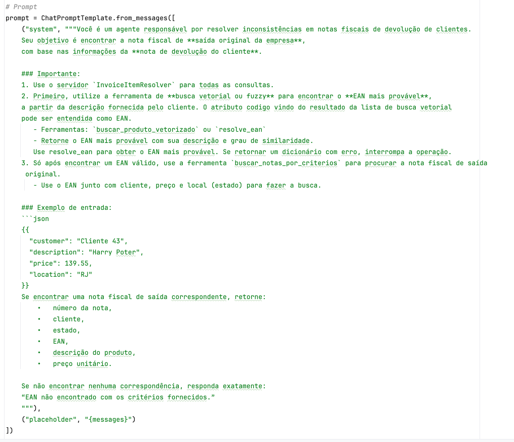
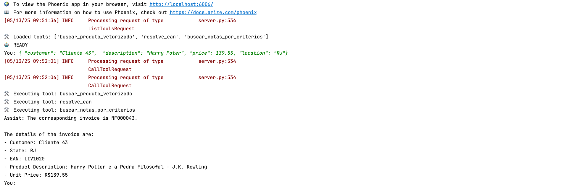
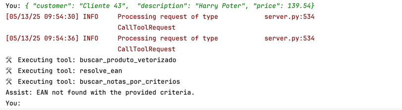
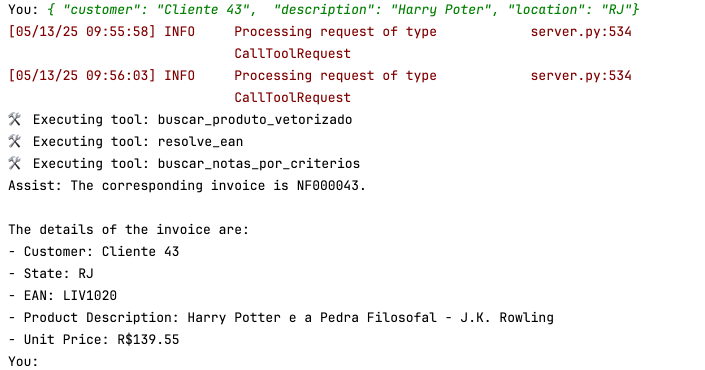

# Construa um Agente de IA com Servidor MCP para Resolução de Notas Fiscais

## Introdução


Empresas que lidam com grandes volumes de produtos — como distribuidores, indústrias e redes de varejo — frequentemente enfrentam o desafio de identificar produtos com base em descrições textuais imprecisas, incompletas ou variadas. Em ambientes onde os dados são inseridos manualmente, erros de digitação, abreviações e nomes comerciais diferentes podem dificultar a identificação correta dos itens em sistemas como ERPs, CRMs e plataformas de e-commerce.

Neste cenário, é comum a necessidade de ferramentas que consigam:

• Interpretar descrições informais ou incorretas fornecidas por usuários;

• Sugerir os produtos mais semelhantes com base em similaridade semântica;

• Garantir um fallback com algoritmos tradicionais (como fuzzy matching), caso a busca semântica não encontre resultados relevantes;

• Ser integrável a APIs e fluxos automatizados de agentes inteligentes.

Neste tutorial, você aprenderá a criar um agente de IA especializado na resolução de inconsistências em **notas fiscais de devolução de clientes**. O agente é capaz de interagir com um **servidor MCP** que fornece ferramentas de busca vetorial e recuperação de notas fiscais, permitindo que o agente encontre automaticamente a **nota fiscal de saída original da empresa** com base em informações fornecidas pelo cliente.


Um **MCP Server (Multi-Agent Communication Protocol Server)** é um componente de software responsável por intermediar a comunicação entre agentes inteligentes e serviços externos por meio de um protocolo padronizado de mensagens e ferramentas (tools). Ele funciona como uma ponte entre modelos de linguagem (LLMs) e APIs já existentes, permitindo que agentes de IA acessem funcionalidades específicas de sistemas legados sem a necessidade de reescrevê-los ou adaptá-los diretamente.

**Como ele funciona?**

O servidor MCP:

•	Expõe um conjunto de ferramentas nomeadas (tools) que representam ações ou serviços que os agentes podem chamar.

•	Cada ferramenta pode estar conectada a uma função de banco de dados, API REST, sistema legado, ou qualquer operação programável.

•	Recebe comandos do agente (em JSON), executa o serviço correspondente e devolve uma resposta padronizada.

**Uso com aplicações legadas**

Aplicações legadas muitas vezes já oferecem funcionalidades acessíveis via banco de dados, arquivos ou APIs internas. Com um MCP Server, você pode:

•	Encapsular chamadas a serviços REST, procedures ou SQL.

•	Tornar esses serviços acessíveis a um agente via uma interface unificada de comunicação.

•	Integrar sistemas antigos com arquiteturas modernas baseadas em IA conversacional e RAG.

**Vantagens**

•	Reaproveitamento de lógica de negócio existente.

•	Não é necessário refatorar sistemas antigos.

•	Permite que agentes LLM interajam com sistemas externos de forma segura e controlada.

•	Facilita testes, versionamento e modularidade da integração entre IA e backend.

Este agente utiliza como base um modelo de linguagem da **Oracle Cloud Generative AI**, integrando-se com ferramentas declaradas dinamicamente e gerenciadas por um servidor **MCP**.

---

## Pré-requisitos

Antes de iniciar, certifique-se de ter os seguintes itens:

- Python 3.10 ou superior instalado
- Acesso a uma conta Oracle Cloud com o serviço OCI Generative AI habilitado
- Biblioteca [`langchain`](https://python.langchain.com) instalada e configurada
- Acesso ao modelo `cohere.command-r-08-2024` via OCI Generative AI
- Bibliotecas auxiliares instaladas:
    - `oracledb`
    - `sentence_transformers`
    - `numpy`
    - `mcp-server-fastmcp`
    - `asyncio`
    - `langchain_core`
    - `langchain_community`
    - `mcp`
    - `langgraph`
    - `langchain_mcp_adapters`
    - `phoenix` (para observabilidade com OpenTelemetry)
    - `opentelemetry-sdk`, `opentelemetry-exporter-otlp`
- Um servidor MCP funcional com as ferramentas:
    - `resolve_ean`
    - `buscar_produto_vetorizado`
    - `buscar_notas_por_criterios`
- Arquivo `server_nf_items.py` configurado para ser executado como servidor MCP simulando um ERP

---

## Objetivos

Ao final deste tutorial, você será capaz de:

- Configurar um agente de IA com LangGraph e LangChain para trabalhar com prompts estruturados
- Integrar este agente a um servidor MCP via protocolo `stdio`
- Utilizar ferramentas remotas registradas no servidor para:
    - Realizar buscas vetoriais a partir de descrições de produtos
    - Identificar o código EAN mais provável de um item
    - Buscar notas fiscais originais com base em critérios como cliente, estado e preço
- Monitorar a execução do agente em tempo real usando o **Phoenix** e **OpenTelemetry**
- Simular uma resolução real de problema com base em um JSON de entrada como:

  ```json
  {
    "customer": "Cliente 43",
    "description": "Harry Poter",
    "price": 139.55,
    "location": "RJ"
  }

## Tarefa 1: Criar um Banco de Dados Oracle Autonomous Database 23ai (Always Free)

Nesta etapa, você aprenderá como provisionar um banco de dados Oracle Autonomous Database 23ai na modalidade Always Free. Essa versão oferece um ambiente totalmente gerenciado, ideal para desenvolvimento, testes e aprendizado, sem custos adicionais.

Antes de iniciar, certifique-se de:

- Possuir uma conta na Oracle Cloud Infrastructure (OCI). Se ainda não tiver, você pode se registrar gratuitamente em [oracle.com/cloud/free](https://www.oracle.com/cloud/free/).
- Ter acesso ao Oracle Cloud Console para gerenciar seus recursos na nuvem.

### Etapas para Criar o Banco de Dados

1. **Acesse o Oracle Cloud Console**:
    - Navegue até [Oracle Cloud Console](https://cloud.oracle.com/) e faça login com suas credenciais.

2. **Inicie o Provisionamento do Autonomous Database**:
    - No menu de navegação, selecione **"Oracle Database"** e, em seguida, **"Autonomous Database"**.
    - Clique em **"Criar Instância do Autonomous Database"**.

3. **Configure os Detalhes da Instância**:
    - **Nome do Banco de Dados**: Escolha um nome identificador para sua instância.
    - **Tipo de Carga de Trabalho**: Selecione entre *Data Warehouse* ou *Transaction Processing*, conforme suas necessidades.
    - **Compartimento**: Escolha o compartimento apropriado para organizar seus recursos.

4. **Selecione a Opção Always Free**:
    - Certifique-se de marcar a opção **"Always Free"** para garantir que a instância seja provisionada na modalidade gratuita.

5. **Defina as Credenciais de Acesso**:
    - Crie uma senha segura para o usuário ADMIN, que será utilizada para acessar o banco de dados.

6. **Finalize o Provisionamento**:
    - Revise as configurações e clique em **"Criar Autonomous Database"**.
    - Aguarde alguns minutos até que a instância seja provisionada e esteja disponível para uso.

## Tarefa 2: Executar o Script de Criação de Tabelas no Autonomous Database

Agora que o Oracle Autonomous Database 23ai foi provisionado com sucesso, o próximo passo é preparar o banco de dados para o nosso caso de uso. Vamos executar o script SQL [script.sql](./source/script.sql) que cria três tabelas essenciais para o cenário de reconciliação de notas fiscais com agentes de IA:

- `PRODUTOS`
- `NOTA_FISCAL`
- `ITEM_NOTA_FISCAL`

### Etapas para Executar o Script

1. **Acesse o Autonomous Database**:
    - No [Oracle Cloud Console](https://cloud.oracle.com/), vá até **"Oracle Database" > "Autonomous Database"**.
    - Clique sobre o nome da instância recém-criada.

2. **Abra a SQL Console**:
    - No painel da instância, clique em **"Database Actions"**.
    - Em seguida, clique em **"SQL"** para abrir o SQL Console no navegador.

3. **Copie e Cole o Script SQL**:
    - Abra o arquivo [script.sql](./source/script.sql) localmente e copie todo o conteúdo.
    - Cole no editor do SQL Console.

4. **Execute o Script**:
    - Clique em **"Run"** ou pressione `Ctrl+Enter` para executar.
    - Aguarde a confirmação de que os comandos foram executados com sucesso.

5. **Valide as Tabelas Criadas**:
    - Você pode usar os seguintes comandos para verificar se as tabelas foram criadas:
      ```sql
      SELECT table_name FROM user_tables;
      ```
## Tarefa 3: Inserir Dados de Exemplo nas Tabelas

Com as tabelas criadas no Autonomous Database, agora é hora de inserir dados fictícios que simularão um cenário real para a aplicação de agentes de IA. Utilizaremos dois scripts SQL:

- [insert_produtos_livros.sql](./source/inserts_produtos_livros.sql) – insere uma lista de livros como produtos, com seus respectivos EANs e descrições.
- [notas_fiscais_mock.sql](./source/notas_fiscais_mock.sql) – insere registros de notas fiscais de saída simuladas, associadas a clientes, produtos e preços.

Esses dados serão usados pelos agentes de IA para resolver inconsistências em notas de devolução.

### Etapas para Executar os Scripts

1. **Acesse o SQL Console**:
    - No Oracle Cloud Console, vá até sua instância do Autonomous Database.
    - Acesse **Database Actions > SQL**.

2. **Execute o Script de Produtos**:
    - Abra o conteúdo do arquivo [insert_produtos_livros.sql](./source/inserts_produtos_livros.sql) e cole no editor SQL.
    - Clique em **"Run"** ou pressione `Ctrl+Enter`.

3. **Execute o Script de Notas Fiscais**:
    - Agora abra o conteúdo do arquivo [notas_fiscais_mock.sql](./source/notas_fiscais_mock.sql) e cole no editor.
    - Execute da mesma forma.

4. **Validar os Dados Inseridos**:
    - Você pode verificar os dados com comandos como:
      ```sql
      SELECT * FROM PRODUTOS;
      SELECT * FROM NOTA_FISCAL;
      SELECT * FROM ITEM_NOTA_FISCAL;
      ```

## Tarefa 4: Criar e Compilar a Função de Busca Avançada no Banco de Dados

O próximo passo é criar uma função PL/SQL chamada `fn_busca_avancada`, que realiza buscas inteligentes por palavras-chave em descrições de produtos. Essa função será utilizada pelos agentes de IA como parte da ferramenta `resolve_ean`, permitindo encontrar o código EAN mais próximo com base na descrição fornecida por um cliente na nota de devolução.

### O Que a Função Faz?

A função `fn_busca_avancada` realiza:

1. **Tokenização** dos termos informados (ex: `"harry poter pedra"` vira `["harry", "poter", "pedra"]`).
2. **Busca direta** nas descrições (`LIKE '%termo%'`) → +3 pontos.
3. **Busca fonética** com `SOUNDEX` → +2 pontos.
4. **Busca por escrita similar** com `UTL_MATCH.EDIT_DISTANCE <= 2` → +1 ponto.
5. Soma a pontuação para cada produto e retorna aqueles com score > 0.
6. Retorna os produtos como objetos do tipo `produto_resultado`, contendo:
    - `codigo` (EAN),
    - `descricao` do produto,
    - `similaridade` (pontuação da busca).

### Etapas de Execução

1. **Copie e cole o script completo [fn_busca_fonetica_produtos.sql](./source/fn_busca_fonetica_produtos.sql) no SQL Console do Autonomous Database.**
    - Isso inclui:
        - Criação da tabela `produtos` (se ainda não foi feita).
        - Criação de índice de texto.
        - Tipos `produto_resultado` e `produto_resultado_tab`.
        - A função `fn_busca_avancada`.
        - Testes opcionais.

2. **Execute o script completo.** O resultado deverá ser `Function created` e `Type created`.

3. **Teste a função com descrições simuladas:**

```sql
SELECT * 
FROM TABLE(fn_busca_avancada('harry poter pedra'))
ORDER BY similaridade DESC;
```

## Tarefa 5: Vetorizar os Produtos para Busca Semântica com IA

Nesta tarefa, vamos **complementar a busca avançada baseada em SQL** com uma nova abordagem baseada em **vetores semânticos**. Isso será especialmente útil para agentes de IA que usam embeddings (representações numéricas de frases) para comparar similaridade entre descrições de produtos — de forma mais flexível e inteligente que buscas por palavras ou fonética.

Para isso, será utilizado o script Python [process_vector_products.py](./source/process_vector_products.py), que conecta ao banco Oracle, extrai os produtos da tabela `PRODUTOS`, transforma suas descrições em vetores (embeddings), e constrói um índice vetorial utilizando o próprio banco de dados Oracle.

---

### O Que o Script Faz?

1. **Leitura dos produtos** a partir da tabela `produtos` via `oracledb`;
2. **Geração dos embeddings** usando o modelo `all-MiniLM-L6-v2` do pacote `sentence-transformers`;
3. **Criação da tabela `embeddings_produtos`** para armazenar os vetores diretamente no Oracle;
4. **Inserção ou atualização dos registros**, gravando o vetor como um BLOB binário (em formato `float32` serializado).

> **Nota:** Os embeddings são convertidos em bytes com `np.float32.tobytes()` para serem armazenados como BLOB. Para recuperar os vetores, utilize `np.frombuffer(blob, dtype=np.float32)`.

Esse formato permite que futuras buscas por similaridade sejam feitas diretamente via SQL ou carregando os vetores do banco para operações com `np.dot`, `cosine_similarity` ou integração com LLMs.

Este script realiza a geração de embeddings semânticos para produtos e grava esses vetores no banco de dados Oracle 23ai. A seguir, destacamos os pontos principais:

---

### 1. Configuração da Conexão com Oracle usando Wallet

O código utiliza a biblioteca `oracledb` em modo **thin** e configura o acesso seguro usando um **Oracle Wallet**.

```python
os.environ["TNS_ADMIN"] = WALLET_PATH
connection = oracledb.connect(
    user=USERNAME,
    password=PASSWORD,
    dsn=DB_ALIAS,
    ...
)
```

---

### 2. Consulta à Tabela de Produtos

A tabela `produtos` contém os dados originais (ID, código e descrição). Essas descrições são usadas como base para gerar os vetores semânticos.

```python
cursor.execute("SELECT id, codigo, descricao FROM produtos")
```

---

### 3. Geração de Embeddings com `sentence-transformers`

O modelo `all-MiniLM-L6-v2` é utilizado para transformar as descrições dos produtos em vetores numéricos de alta dimensão.

```python
model = SentenceTransformer('all-MiniLM-L6-v2')
embeddings = model.encode(descricoes, convert_to_numpy=True)
```

---

### 4. Criação da Tabela de Embeddings (se não existir)

A tabela `embeddings_produtos` é criada dinamicamente com os seguintes campos:

- `id`: identificador do produto (chave primária)
- `codigo`: código do produto
- `descricao`: descrição original
- `vetor`: BLOB contendo o vetor serializado em `float32`

```sql
CREATE TABLE embeddings_produtos (
    id NUMBER PRIMARY KEY,
    codigo VARCHAR2(100),
    descricao VARCHAR2(4000),
    vetor BLOB
)
```

> Obs.: A criação usa `EXECUTE IMMEDIATE` dentro de um `BEGIN...EXCEPTION` para evitar erro se a tabela já existir.

---

### 5. Inserção ou Atualização via `MERGE`

Para cada produto, o vetor é convertido em bytes (`float32`) e inserido ou atualizado na tabela `embeddings_produtos` usando um `MERGE INTO`.

```python
vetor_bytes = vetor.astype(np.float32).tobytes()
```

```sql
MERGE INTO embeddings_produtos ...
```

---

### Para Executar o Script

Lembre-se de que é necessário o **Oracle Wallet** baixado e configurado.

Execute no terminal:

```python
python process_vector_products.py
```

Pronto! Os produtos da base de dados estão vetorizados.

### Por que Isso é Importante?

Busca vetorial é altamente eficaz para encontrar produtos mesmo quando a descrição é subjetiva, imprecisa ou está em linguagem natural.

## Entendendo o Código: Agente LLM com Servidor MCP

Este projeto é composto por **3 componentes principais**:

1. **Agente ReAct com LangGraph + LLM da OCI** (Arquivo [main.py](./source/main.py))
2. **Servidor MCP com Ferramentas para Resolução de Notas Fiscais** (Arquivo [server_nf_items.py](./source/server_nf_items.py))
3. **Busca de Produtos Similares com OCI Generative AI e FAISS** (Arquivo [product_search.py](./source/product_search.py))

Abaixo detalhamos a funcionalidade de cada componente e destacamos os trechos mais importantes do código.

---

### 1. Agente ReAct com LangGraph + LLM da OCI

Este componente executa a aplicação principal, onde o usuário interage com o agente baseado em LLM (Large Language Model) da Oracle Cloud. Ele se comunica com o servidor MCP por meio de um protocolo stdio.

### Principais funcionalidades:

* **Configuração de Telemetria com Phoenix e OpenTelemetry**

```python
px.launch_app()
...
trace.set_tracer_provider(provider)
```

* **Criação do modelo LLM usando `ChatOCIGenAI`**:

```python
llm = ChatOCIGenAI(
    model_id="cohere.command-r-08-2024",
    ...
)
```

* **Definição do prompt orientado à tarefa de reconciliação de notas fiscais**:

```python
prompt = ChatPromptTemplate.from_messages([
    ("system", """Você é um agente responsável por resolver inconsistências em notas fiscais..."""),
    ("placeholder", "{messages}")
])
```

* **Execução do servidor MCP local via stdio**

```python
server_params = StdioServerParameters(
    command="python",
    args=["server_nf_items.py"],
)
```

* **Loop principal de interação com o usuário:**

```python
while True:
    query = input("You: ")
    ...
    result = await agent_executor.ainvoke({"messages": memory_state.messages})
```

* **Integração com ferramentas expostas pelo servidor MCP:**

```python
agent_executor = create_react_agent(
    model=llm,
    tools=tools,
    prompt=prompt,
)
```

**Servidores Múltiplos de MCP**

Se precisa consumir mais servidores **MCP**, ajuste a declaração abaixo:

```python
# Run the client with the MCP server
async def main():
    async with MultiServerMCPClient(
            {
                "InvoiceItemResolver": {
                    "command": "python",
                    "args": ["server_nf_items.py"],
                    "transport": "stdio",
                },
                "InvoiceItemResolver": {
                    "command": "python",
                    "args": ["another_mcp_server.py"],
                    "transport": "stdio",
                },
                ...
            }
    ) as client:
        tools = client.get_tools()
        if not tools:
            print("❌ No MCP tools were loaded. Please check if the server is running.")
            return
```

### Prompt

O prompt é fundamental para estabelecer o processo e as regras de funcionamento para o Agente de IA.



---

### 2. Servidor MCP com Ferramentas de Resolução

Este servidor responde às chamadas do agente, fornecendo ferramentas que acessam um banco de dados Oracle com informações de produtos e notas fiscais.

### Principais funcionalidades:

* **Inicialização do servidor MCP com o nome `InvoiceItemResolver`**:

```python
mcp = FastMCP("InvoiceItemResolver")
```

* **Conexão com o banco Oracle via Oracle Wallet:**

```python
connection = oracledb.connect(
    user=USERNAME,
    password=PASSWORD,
    dsn=DB_ALIAS,
    wallet_location=WALLET_PATH,
    ...
)
```

* **Implementação das ferramentas MCP**:

#### `buscar_produto_vetorizado`

Busca produtos similares com embeddings:

```python
@mcp.tool()
def buscar_produto_vetorizado(descricao: str) -> dict:
    return buscador.buscar_produtos_similares(descricao)
```

#### `resolve_ean`

Resolve um EAN com base em similaridade da descrição:

```python
@mcp.tool()
def resolve_ean(description: str) -> dict:
    result = executar_busca_ean(description)
    ...
    return {"ean": result[0]["codigo"], ...}
```

#### `buscar_notas_por_criterios`

Busca notas fiscais de saída com base em múltiplos filtros:

```python
@mcp.tool()
def buscar_notas_por_criterios(cliente: str = None, estado: str = None, preco: float = None, ean: str = None, ...):
    query = """
        SELECT nf.numero_nf, ...
        FROM nota_fiscal nf
        JOIN item_nota_fiscal inf ON nf.numero_nf = inf.numero_nf
        WHERE 1=1
        ...
    """
```

* **Execução do servidor em modo `stdio`:**

```python
if __name__ == "__main__":
    mcp.run(transport="stdio")
```

### 3. Busca de Produtos Similares com OCI Generative AI e Banco de dados Vetorial

Este módulo [product_search.py](./source/product_search.py) implementa uma classe Python que permite buscar produtos semanticamente similares a partir de uma descrição textual, utilizando:

- Embeddings da **OCI Generative AI**
- Índices vetoriais com **Oracle Database 23ai**
- Comparações fuzzy com **RapidFuzz** como fallback

---


## Tarefa 5: Configurando o Modelo e Embeddings no Agente MCP

Vamos configurar o modelo de linguagem e os embeddings usados pelo agente conversacional com base no protocolo MCP, utilizando os serviços da Oracle Cloud Infrastructure (OCI) Generative AI.

---

### 1. Configurando o Modelo de Linguagem (LLM)

O modelo de linguagem é responsável por interpretar mensagens, gerar respostas e atuar como cérebro principal do agente.

### Configure no arquivo main.py

```python
from langchain_community.chat_models.oci_generative_ai import ChatOCIGenAI

llm = ChatOCIGenAI(
    model_id="cohere.command-r-08-2024",
    service_endpoint="https://inference.generativeai.us-chicago-1.oci.oraclecloud.com",
    compartment_id="ocid1.compartment.oc1..aaaaaaaaaaaaaaaaaaaaaaaaaaaaaaaaaaaaaaaaaaaaaaaaaaaaaaaaaaaaaa",
    auth_profile="DEFAULT",
    model_kwargs={"temperature": 0.1, "top_p": 0.75, "max_tokens": 2000}
)
```

### Parâmetros

| Parâmetro         | Descrição |
|------------------|-----------|
| `model_id`       | ID do modelo Generative AI, ex: `cohere.command-r-08-2024` |
| `service_endpoint` | Endpoint regional do serviço Generative AI |
| `compartment_id` | OCID do compartimento OCI |
| `auth_profile`   | Nome do perfil configurado no arquivo `~/.oci/config` |
| `model_kwargs`   | Temperatura, top-p e tamanho da resposta |


### Como Listar os Modelos Disponíveis

### Usando o CLI

```bash
  oci generative-ai model list --compartment-id <seu_compartment_id>
```

### Usando o Python SDK

```python
from oci.generative_ai import GenerativeAiClient
from oci.config import from_file

config = from_file(profile_name="DEFAULT")
client = GenerativeAiClient(config)

models = client.list_models(compartment_id=config["compartment_id"])
for model in models.data:
    print(model.display_name, model.model_id)
```


---

### 2. Configurando Embeddings para Busca Semântica

A busca por produtos similares ou informações contextuais depende de embeddings vetoriais.

### Exemplo de uso no agente

```python
@mcp.tool()
def buscar_produto_vetorizado(descricao: str) -> dict:
    return buscador.buscar_produtos_similares(descricao)
```

Altere os parametros (Arquivo [product_search.py](./source/product_search.py)) conforme a orientação abaixo:

```python

class BuscaProdutoSimilar:
    def __init__(
            self,
            top_k=5,
            distancia_minima=1.0,
            model_id="cohere.embed-english-light-v3.0",
            service_endpoint="https://inference.generativeai.us-chicago-1.oci.oraclecloud.com",
            compartment_id="ocid1.compartment.oc1..aaaaaaaaaaaaaaaaaaaaaaaaaaaaaaaaaaaaaaaaaaaaaaaaaaaaaaaa",
            auth_profile="DEFAULT",
            wallet_path="/WALLET_PATH/Wallet_oradb23ai",
            db_alias="oradb23ai_high",
            username="USER",
            password="Password"
    ):
```

### Parâmetros Explicados

| Parâmetro          | Descrição                                                                 |
|--------------------|---------------------------------------------------------------------------|
| `top_k`            | Número de sugestões retornadas.                                           |
| `distancia_minima` | Distância máxima para considerar resultado relevante.                     |
| `model_id`         | ID do modelo de embedding na OCI (ex: `cohere.embed-english-light-v3.0`). |
| `service_endpoint` | Endpoint regional da OCI Generative AI.                                   |
| `compartment_id`   | OCID do compartimento.                                                    |
| `auth_profile`     | Nome do perfil no arquivo `~/.oci/config`.                                |
| `wallet_path`      | Caminho para a wallet do Oracle Database 23ai.                            |
| `db_alias`         | Alias para o banco de dados.                                              |
| `username`         | Usuário do banco de dados.                                                |
| `password`         | Senha do banco de dados.                                                  |


### 3. Configurando o Servidor MCP

Assim como feito anteriormente na execução do código [process_vector_products.py](./source/process_vector_products.py), será necessária a configuração do **Oracle Wallet** para o banco de dados **23ai**.

Modifique os parâmetros conforme suas configurações:

```python
import os

# Configurações Oracle Wallet
WALLET_PATH = "/caminho/para/Wallet"
DB_ALIAS = "oradb23ai_high"
USERNAME = "admin"
PASSWORD = "..."

# Define a variável de ambiente necessária para o cliente Oracle
os.environ["TNS_ADMIN"] = WALLET_PATH
```


---

Com isso, o modelo LLM e os embeddings estarão prontos para serem usados pelo agente MCP com LangGraph e LangChain.

## Tarefa 6: Testar a busca pela descrição de Produto e Nota Fiscal

Executar o arquivo [main.py](./source/main.py) conforme abaixo:

```python
python main.py
```

Ao aparecer o prompt **You:**, digite:

    { "customer": "Cliente 43",  "description": "Harry Poter", "price": 139.55, "location": "RJ"}

Perceba que o nome do livro **"Harry Potter"** está grafado errado, porém o mecanismo consegue encontrar sem problemas.



Perceba que foram executados os serviços:

    buscar_produto_vetorizado
    resolve_ean
    buscar_notas_por_criterios

Agora digite:

     { "customer": "Cliente 43",  "description": "Harry Poter", "price": 139.54}

Verá que não houve registro de Nota Fiscal encontrado. Isto ocorre porque a localização é fundamental para encontrar uma NF.



Digite:

    { "customer": "Cliente 43",  "description": "Harry Poter", "location": "RJ"}

Desta vez, inserimos a localização, porém omitimos o preço unitário:



E mesmo assim foi encontrada a NF. Isto porque o preço não é fundamental porém ajuda a fechar mais o cerco para se ter mais assertividiade.

Alguns exemplos para testes:

    { "customer": "Cliente 43",  "description": "Harry Poter", "price": 139.55, "location": "RJ"}
    { "customer": "Cliente 43",  "description": "Harry Poter", "price": 139.54, "location": "RJ"}
    { "customer": "Cliente 43",  "description": "Harry Poter", "price": 141.60, "location": "RJ"}
    { "customer": "Cliente 43",  "description": "Harry Poter", "price": 139.54}
    { "customer": "Cliente 43",  "description": "Harry Poter", "location": "RJ"}
    { "customer": "Cliente 43",  "description": "Harry Poter", "location": "SP"}
    
    
    { "customer": "Cliente 149",  "description": "Expresso oriente", "location": "SP"}
    { "customer": "Cliente 149",  "description": "Expresso oriente", "location": "RJ"}
    { "customer": "Cliente 149",  "description": "Expresso oriente"}
    { "customer": "Cliente 149",  "description": "Expresso oriente", "price": 100.00, "location": "SP"}

## Conclusão

Com esses dois componentes integrados, o sistema permite que um agente baseado em LLM da Oracle:

* Utilize ferramentas hospedadas remotamente via MCP
* Faça buscas inteligentes por produtos e EANs
* Localize notas fiscais de saída correspondentes
* Registre tudo em observabilidade via Phoenix + OpenTelemetry

Este design modular permite reusabilidade e fácil evolução do sistema para outros domínios além de notas fiscais.


## Referências

- [Introdução ao Oracle Autonomous Database](https://www.oracle.com/autonomous-database/get-started/)
- [Documentação do Oracle Database 23ai](https://docs.oracle.com/en/database/oracle/oracle-database/23/)
- [Blog da Oracle sobre o Autonomous Database 23ai Always Free](https://blogs.oracle.com/datawarehousing/post/23ai-autonomous-database-free)
- [Develop a Simple AI Agent Tool using Oracle Cloud Infrastructure Generative AI and REST APIs](https://docs.oracle.com/en/learn/oci-agent-ai/)

## Acknowledgments

- **Author** - Cristiano Hoshikawa (Oracle LAD A-Team Solution Engineer)
