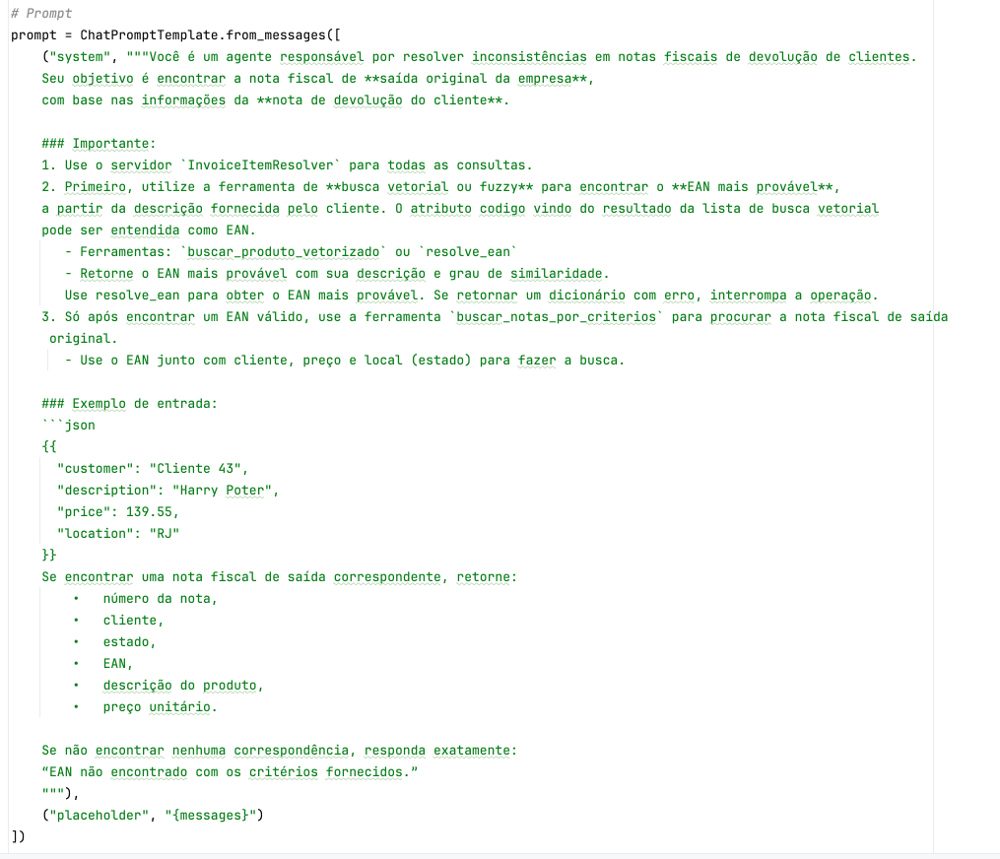

# Build an AI Agent with MCP Server for Invoice Resolution

## Introduction


Companies that deal with large volumes of products - such as distributors, industries and retail chains - often face the challenge of identifying products based on inaccurate, incomplete or varied textual descriptions. In environments where data is entered manually, typos, abbreviations and different trade names can make it difficult to correctly identify items in systems such as ERPs, CRMs and e-commerce platforms.

In this scenario, there is a common need for tools that can:

- Interpret informal or incorrect descriptions provided by users;

- Suggest the most similar products based on semantic similarity;

- Guarantee a fallback with traditional algorithms (such as fuzzy matching) if the semantic search does not find relevant results;

- Integrate with APIs and automated flows of intelligent agents.

In this tutorial, you will learn how to create an AI agent specialized in resolving inconsistencies in **customer return invoices**. The agent is able to interact with an MCP server that provides vector search and invoice retrieval tools, allowing the agent to automatically find the company's original A/R invoice based on information provided by the customer.

Communication between the agent and the server takes place via the **MCP (Multi-Agent Communication Protocol)** protocol, guaranteeing modularity, scalability and efficient integration between services.

This agent is based on an Oracle Cloud Generative AI language model and integrates with dynamically declared tools managed by an MCP server.

---

## Prerequisites

Before you start, make sure you have the following items:

- Python 3.10 or higher installed
- Access to an Oracle Cloud account with the OCI Generative AI service enabled
- Library [`langchain`](https://python.langchain.com) installed and configured
- Access to the `cohere.command-r-08-2024` model via OCI Generative AI
- Auxiliary libraries installed:
    - `oracledb`
    - `sentence_transformers`
    - `numpy`
    - `mcp-server-fastmcp`
    - `asyncio`
    - `langchain_core`
    - `langchain_community`
    - `mcp`
    - `langgraph`
    - `langchain_mcp_adapters`
    - `phoenix` (for observability with OpenTelemetry)
    - `opentelemetry-sdk`, `opentelemetry-exporter-otlp`
- A functional MCP server with the tools:
    - `resolve_ean`
    - `search_vectorized_product`
    - `fetch_notes_by_criteria`
- File `server_nf_items.py` configured to run as an MCP server simulating an ERP

---

## Objectives

By the end of this tutorial, you will be able to:

- Configure an AI agent with LangGraph and LangChain to work with structured prompts
- Integrate this agent with an MCP server via the `stdio` protocol
- Use remote tools registered on the server to:
    - Perform vector searches from product descriptions
    - Identify the most likely EAN code for an item
    - Search for original invoices based on criteria such as customer, state and price
- Monitor agent execution in real time using **Phoenix** and **OpenTelemetry**
- Simulate a real problem resolution based on a JSON input such as:

  ``json
  {
    "customer": "Customer 43",
    "description": "Harry Potter",
    "price": 139.55,
    "location": "RJ"
  }

## Task 1: Create an Oracle Autonomous Database 23ai (Always Free)

In this step, you will learn how to provision an Oracle Autonomous Database 23ai in Always Free mode. This version offers a fully managed environment, ideal for development, testing and learning, at no additional cost.

Before you start, make sure you

- You have an Oracle Cloud Infrastructure (OCI) account. If you don't already have one, you can register for free at [oracle.com/cloud/free](https://www.oracle.com/cloud/free/).
- Have access to the Oracle Cloud Console to manage your cloud resources.

### Steps to Create the Database

1. **Access the Oracle Cloud Console:
    - Navigate to [Oracle Cloud Console](https://cloud.oracle.com/) and log in with your credentials.

2. **Start Autonomous Database Provisioning**:
    - From the navigation menu, select **"Oracle Database"** and then **"Autonomous Database"**.
    - Click on **"Create Autonomous Database Instance"**.

3. **Configure the Instance Details:
    - **Database Name**: Choose an identifying name for your instance.
    - Workload Type**: Select between *Data Warehouse* or *Transaction Processing*, according to your needs.
    - Compartment**: Choose the appropriate compartment to organize your resources.

4. **Select the Always Free option:
    - Make sure you check the "Always Free" option to ensure that the instance is provisioned for free.

5. **Set Access Credentials**:
    - Create a secure password for the ADMIN user, which will be used to access the database.

6. **Finalize Provisioning**:
    - Review the settings and click **"Create Autonomous Database"**.
    - Wait a few minutes for the instance to be provisioned and available for use.

## Task 2: Run the Autonomous Database Table Creation Script

Now that Oracle Autonomous Database 23ai has been successfully provisioned, the next step is to prepare the database for our use case. Let's run the SQL script [script.sql](./source/script.sql) that creates three essential tables for the scenario of reconciling invoices with AI agents:

- `PRODUCT`
- `INVOICE`
- `INVOICE_ITEM`

### Steps to Run the Script

1. **Access the Autonomous Database:
    - In the [Oracle Cloud Console](https://cloud.oracle.com/), go to **"Oracle Database" &gt; "Autonomous Database"**.
    - Click on the name of the newly created instance.

2. **Open the SQL Console:
    - In the instance panel, click on **"Database Actions"**.
    - Then click on **"SQL"** to open the SQL Console in the browser.

3. **Copy and Paste the SQL Script**:
    - Open the file [script.sql](./source/script.sql) locally and copy all the contents.
    - Paste it into the SQL Console editor.

4. **Run the script:
    - Click **"Run"** or press `Ctrl+Enter` to execute.
    - Wait for confirmation that the commands have been executed successfully.

5. **Validate the Created Tables**:
    - You can use the following commands to verify that the tables have been created:
      ```sql
      SELECT table_name FROM user_tables;
      ```
## Task 3: Insert Example Data into Tables

With the tables created in the Autonomous Database, it's now time to insert dummy data that will simulate a real scenario for the application of AI agents. We will use two SQL scripts:

- [insert_products_books.sql](./source/inserts_products_books.sql) - inserts a list of books as products, with their respective EANs and descriptions.
- [notas_fiscais_mock.sql](./source/notas_fiscais_mock.sql) - inserts mock A/R invoice records, associated with customers, products and prices.

This data will be used by AI agents to resolve inconsistencies in returns invoices.

### Steps to Run the Scripts

1. **Access the SQL Console:
    - In the Oracle Cloud Console, go to your Autonomous Database instance.
    - Go to Database Actions &gt; SQL.

2. **Run the Product Script**:
    - Open the contents of the file [insert_products_books.sql](./source/inserts_products_books.sql) and paste it into the SQL editor.
    - Click on **"Run"** or press `Ctrl+Enter`.

3. **Run the Invoice Script**:
    - Now open the contents of the file [notas_fiscais_mock.sql](./source/notas_fiscais_mock.sql) and paste it into the editor.
    - Run in the same way.

4. **Validate the entered data:
    - You can check the data with commands such as:
      ```sql
      SELECT * FROM PRODUCTS;
      SELECT * FROM NOTA_FISCAL;
      SELECT * FROM ITEM_NOTA_FISCAL;
      ```

## Task 4: Create and Compile the Advanced Search Function in the Database

The next step is to create a PL/SQL function called `fn_advanced_search`, which performs intelligent searches for keywords in product descriptions. This function will be used by AI agents as part of the `resolve_ean` tool, allowing them to find the nearest EAN code based on the description provided by a customer on the returns note.

### What does the function do?

The `fn_advanced_search` function performs:

1. **Tokenization of the terms entered (e.g. `"harry poter stone"` becomes `["harry", "poter", "stone"]`).
2. **Direct search** in descriptions (`LIKE '%term%'`) → +3 points.
3. **Phonetic search** with `SOUNDEX` → +2 points.
4. **Search for similar writing** with `UTL_MATCH.EDIT_DISTANCE <= 2` → +1 ponto.
5. Soma a pontuação para cada produto e retorna aqueles com score > 0.
6. Returns the products as objects of type `result_product`, containing:
    - `code` (EAN),
    - `description` of the product,
    - `similarity` (search score).

### Execution steps

1. **Copy and paste the complete script into the Autonomous Database SQL Console.
    - This includes:
        - Creating the `products` table (if it hasn't already been done).
        - Creating a text index.
        - Types `product_result` and `product_result_tab`.
        - The `fn_advanced_search` function.
        - Optional tests.

2. **Run the complete script. The result should be `Function created` and `Type created`.

3. **Test the function with simulated descriptions.

```sql
SELECT * 
FROM TABLE(fn_busca_avancada('harry poter stone'))
ORDER BY similarity DESC;
```

## Task 5: Vectorize Products for Semantic Search with AI

In this task, we will **complement advanced SQL-based search** with a new approach based on **semantic vectors**. This will be especially useful for AI agents that use embeddings (numerical representations of phrases) to compare similarity between product descriptions - more flexibly and intelligently than word or phonetic searches.

To do this, we will use the Python script [process_vector_products.py](./source/process_vector_products.py), which connects to the Oracle database, extracts the products from the `PRODUCTS` table, transforms their descriptions into vectors (embeddings), and builds a vector index using the Oracle database itself.

---

### What does the script do?

1. **Reading the products from the `products` table via `oracledb`;
2. **Generates the embeddings using the `all-MiniLM-L6-v2` model from the `sentence-transformers` package;
3. **Creation of the `embeddings_products` table to store the vectors directly in Oracle;
4. **Inserting or updating the records**, saving the vector as a binary BLOB (in serialized `float32` format).

&gt; Note:** The embeddings are converted into bytes with `np.float32.tobytes()` to be stored as a BLOB. To retrieve the vectors, use `np.frombuffer(blob, dtype=np.float32)`.

This format allows future similarity searches to be done directly via SQL or by loading the vectors from the database for operations with `np.dot`, `cosine_similarity` or integration with LLMs.

This script generates semantic embeddings for products and writes these vectors to the Oracle 23ai database. The main points are highlighted below:

---

### 1. configuring the connection to Oracle using Wallet

The code uses the `oracledb` library in **thin** mode and configures secure access using an **Oracle Wallet**.

```python
os.environ["TNS_ADMIN"] = WALLET_PATH
connection = oracledb.connect(
    user=USERNAME,
    password=PASSWORD,
    dsn=DB_ALIAS,
    ...
)
```

---

### 2. Consultation of the Product Table

The `products` table contains the original data (ID, code and description). These descriptions are used as the basis for generating the semantic vectors.

```python
cursor.execute("SELECT id, code, description FROM products")
```

---

### 3. generating embeddings with `sentence-transformers`

The `all-MiniLM-L6-v2` model is used to transform product descriptions into high-dimensional numerical vectors.

```python
model = SentenceTransformer('all-MiniLM-L6-v2')
embeddings = model.encode(descriptions, convert_to_numpy=True)
```

---

### 4. Creating the Embeddings Table (if it doesn't exist)

The `embeddings_products` table is created dynamically with the following fields:

- `id`: product identifier (primary key)
- `code`: product code
- `description`: original description
- `vector`: BLOB containing the vector serialized in `float32`

```sql
CREATE TABLE embeddings_products (
    id NUMBER PRIMARY KEY,
    code VARCHAR2(100),
    description VARCHAR2(4000),
    BLOB vector
)
```

&gt; Note: The creation uses `EXECUTE IMMEDIATE` inside a `BEGIN...EXCEPTION` to avoid an error if the table already exists.

---

### 5. Insert or Update via `MERGE`

For each product, the vector is converted into bytes (`float32`) and inserted or updated in the `embeddings_products` table using a `MERGE INTO`.

```python
vector_bytes = vector.astype(np.float32).tobytes()
```

```sql
MERGE INTO embeddings_products ...
```

---

### To Run the Script

Remember that you need **Oracle Wallet** downloaded and configured.

Run it in the terminal:

```python
python process_vector_products.py
```

Done! The products in the database have been vectorized.

### Why is this important?

Vector search is highly effective for finding products even when the description is subjective, imprecise or in natural language.

## Understanding the Code: LLM Agent with MCP Server

This project is made up of **3 main components**:

1. **ReAct Agent with LangGraph + OCI LLM** (File [main.py](./source/main.py))
2. **MCP Server with Invoice Resolution Tools** (File [server_nf_items.py](./source/server_nf_items.py))
3. **Search for Similar Products with OCI Generative AI and FAISS** (File [product_search.py](./source/product_search.py))

Below we detail the functionality of each component and highlight the most important parts of the code.

---

### 1. ReAct Agent with LangGraph + LLM from OCI

This component runs the main application, where the user interacts with the agent based on Oracle Cloud's LLM (Large Language Model). It communicates with the MCP server via a stdio protocol.

### Main features:

**Telemetry configuration with Phoenix and OpenTelemetry**

```python
px.launch_app()
...
trace.set_tracer_provider(provider)
```

* Creation of the LLM model using `ChatOCIGenAI`:

```python
llm = ChatOCIGenAI(
    model_id="cohere.command-r-08-2024",
    ...
)
```

* Definition of the task-oriented prompt for reconciling invoices**:

```python
prompt = ChatPromptTemplate.from_messages([
    ("system", """You are an agent responsible for resolving inconsistencies in invoices...""),
    ("placeholder", "{messages}")
])
```

**Local MCP server execution via stdio**

```python
server_params = StdioServerParameters(
    command="python",
    args=["server_nf_items.py"],
)
```

**Main user interaction loop:**

```python
while True:
    query = input("You: ")
    ...
    result = await agent_executor.ainvoke({"messages": memory_state.messages})
```

**Integration with tools exposed by the MCP server:**

```python
agent_executor = create_react_agent(
    model=llm,
    tools=tools,
    prompt=prompt,
)
```

### Prompt

The prompt is essential for establishing the process and operating rules for the AI Agent.



---

### 2. MCP Server with Resolution Tools

This server responds to agent calls by providing tools that access an Oracle database with product and invoice information.

### Main features:

* Initialization of the MCP server with the name `InvoiceItemResolver`:

```python
mcp = FastMCP("InvoiceItemResolver")
```

**Connection to Oracle bank via Oracle Wallet:**

```python
connection = oracledb.connect(
    user=USERNAME,
    password=PASSWORD,
    dsn=DB_ALIAS,
    wallet_location=WALLET_PATH,
    ...
)
```

**Implementation of MCP tools**:

#### `search_vectorized_product`

Searches for similar products with embeddings:

```python
@mcp.tool()
def fetch_vectorized_product(description: str) -&gt; dict:
    return buscador.buscar_produtos_similares(descricao)
```

#### `resolve_ean`

Resolves an EAN based on description similarity:

```python
@mcp.tool()
def resolve_ean(description: str) -&gt; dict:
    result = execute_search_ean(description)
    ...
    return {"ean": result[0]["code"], ...}
```

#### `search_notes_by_criteria`

Searches for A/R invoices based on multiple filters:

```python
@mcp.tool()
def fetch_invoices_by_criteria(customer: str = None, state: str = None, price: float = None, ean: str = None, ...):
    query = """
        SELECT nf.numero_nf, ...
        FROM nota_fiscal nf
        JOIN item_nota_fiscal inf ON nf.numero_nf = inf.numero_nf
        WHERE 1=1
        ...
    """
```

* Running the server in `stdio` mode:**

```python
if __name__ == "__main__":
    mcp.run(transport="stdio")
```

### 3. Search for Similar Products with OCI Generative AI and Vector Database

This module [product_search.py](./source/product_search.py) implements a Python class that allows you to search for semantically similar products from a textual description, using:

- Embeddings from **OCI Generative AI**
- Vector indexes with **Oracle Database 23ai**
- Fuzzy comparisons with **RapidFuzz** as fallback

---


## Task 5: Configuring the Model and Embeddings in the MCP Agent

Let's configure the language model and embeddings used by the conversational agent based on the MCP protocol, using Oracle Cloud Infrastructure (OCI) Generative AI services.

---

### 1 Configuring the Language Model (LLM)

The language model is responsible for interpreting messages, generating responses and acting as the agent's main brain.

### Configure in the main.py file

```python
from langchain_community.chat_models.oci_generative_ai import ChatOCIGenAI

llm = ChatOCIGenAI(
    model_id="cohere.command-r-08-2024",
    service_endpoint="https://inference.generativeai.us-chicago-1.oci.oraclecloud.com",
    compartment_id="ocid1.compartment.oc1..aaaaaaaaaaaaaaaaaaaaaaaaaaaaaaaaaaaaaaaaaaaaaaaaaaaaaaaaaa",
    auth_profile="DEFAULT",
    model_kwargs={"temperature": 0.1, "top_p": 0.75, "max_tokens": 2000}
)
```

### Parameters

| Parameter | Description
|------------------|-----------|
| `model_id` | Generative AI model ID, e.g. `cohere.command-r-08-2024` |
| `service_endpoint` | Generative AI service regional endpoint |
| `compartment_id` | OCID of the OCI compartment |
| `auth_profile` | Name of the profile configured in the file `~/.oci/config` |
| `model_kwargs` | Temperature, top-p and response size |


### How to List Available Models

### Using the CLI

```bash
  oci generative-ai model list --compartment-id <seu_compartment_id>
```

### Using the Python SDK

```python
from oci.generative_ai import GenerativeAiClient
from oci.config import from_file

config = from_file(profile_name="DEFAULT")
client = GenerativeAiClient(config)

models = client.list_models(compartment_id=config["compartment_id"])
for model in models.data:
    print(model.display_name, model.model_id)
```


---

### 2. Configuring Embeddings for Semantic Search

Searching for similar products or contextual information depends on vector embeddings.

### Example of use in the agent

```python
@mcp.tool()
def fetch_vectorized_product(description: str) -&gt; dict:
    return buscador.buscar_produtos_similares(descricao)
```

Change the parameters (File [product_search.py](./source/product_search.py)) as shown below:

```python

class SimilarProductSearch:
    def __init__(
            self,
            top_k=5,
            minimum_distance=1.0,
            model_id="cohere.embed-english-light-v3.0",
            service_endpoint="https://inference.generativeai.us-chicago-1.oci.oraclecloud.com",
            compartment_id="ocid1.compartment.oc1..aaaaaaaaaaaaaaaaaaaaaaaaaaaaaaaaaaaaaaaaaaaaaaaaaaaa",
            auth_profile="DEFAULT",
            wallet_path="/WALLET_PATH/Wallet_oradb23ai",
            db_alias="oradb23ai_high",
            username="USER",
            password="Password"
    ):
```

### Parameters Explained

| Parameter | Description
|--------------------|---------------------------------------------------------------------------|
| `top_k` | Number of suggestions returned. |
| `minimum_distance` | Maximum distance to consider relevant result. |
| `model_id` | ID of the embedding model in the OCI (e.g. `cohere.embed-english-light-v3.0`). |
| `service_endpoint` | OCI Generative AI regional endpoint. |
| `compartment_id` | compartment OCID. |
| `auth_profile` | Profile name in `~/.oci/config` file. |
| `wallet_path` | Path to the Oracle Database 23ai wallet. |
| `db_alias` | Database alias. |
| `username` | Database user. |
| `password` | Database password. |


### Configuring the MCP Server

Just as you did when executing the [process_vector_products.py] code(./source/process_vector_products.py), you will need to configure the **Oracle Wallet** for the **23ai** database.

Modify the parameters according to your settings:

```python
import os

# Oracle Wallet settings
WALLET_PATH = "/path/to/Wallet"
DB_ALIAS = "oradb23ai_high"
USERNAME = "admin"
PASSWORD = "..."

# Define the environment variable required for the Oracle client
os.environ["TNS_ADMIN"] = WALLET_PATH
```


---

With this, the LLM model and embeddings are ready to be used by the MCP agent with LangGraph and LangChain.

## Task 6: Test the Product and Invoice description search

Run the file [main.py](./source/main.py) as shown below:

```python
python main.py
```

When the **You:** prompt appears, type:

    { "customer": "Customer 43", "description": "Harry Potter", "price": 139.55, "location": "RJ"}

Note that the name of the book **"Harry Potter"** is spelled wrong, but the engine can find it without any problems.


Note that the services have been executed:

    fetch_vectorized_product
    resolve_ean
    fetch_notes_by_criteria

Now type:

     { "customer": "Customer 43", "description": "Harry Poter", "price": 139.54}

You will see that there was no Invoice record found. This is because location is key to finding an invoice.


Type:

    { "customer":"Cliente 43", "description":"Harry Poter", "location":"RJ"}

This time, we enter the location but omit the unit price:


And yet the invoice was found. This is because the price is not fundamental, but it does help to close the gap to be more assertive.

Some examples for testing:

    { "customer": "Cliente 43", "description": "Harry Potter", "price": 139.55, "location": "RJ"}
    { "customer": "Customer 43", "description": "Harry Poter", "price": 139.54, "location": "RJ"}
    { "customer": "Customer 43", "description": "Harry Poter", "price": 141.60, "location": "RJ"}
    { "customer": "Customer 43", "description": "Harry Poter", "price": 139.54}
    { "customer": "Cliente 43", "description": "Harry Poter", "location": "RJ"}
    { "customer": "Cliente 43", "description": "Harry Poter", "location": "SP"}
    
    
    { "customer": "Customer 149", "description": "Expresso oriente", "location": "SP"}
    { "customer": "Customer 149", "description": "Expresso oriente", "location": "RJ"}
    { "customer": "Customer 149", "description": "Expresso oriente"}
    { "customer": "Customer 149", "description": "Expresso oriente", "price": 100.00, "location": "SP"}

## Conclusion

With these two components integrated, the system enables an agent based on Oracle LLM:

* Use remotely hosted tools via MCP
* Perform intelligent searches for products and EANs
* Locate corresponding A/R invoices
* Record everything in observability via Phoenix + OpenTelemetry

This modular design allows for reusability and easy evolution of the system to domains other than invoices.


## References

- [Introduction to Oracle Autonomous Database](https://www.oracle.com/autonomous-database/get-started/)
- [Oracle Database 23ai Documentation](https://docs.oracle.com/en/database/oracle/oracle-database/23/)
- [Oracle Autonomous Database 23ai Always Free Blog](https://blogs.oracle.com/datawarehousing/post/23ai-autonomous-database-free)
- [Develop a Simple AI Agent Tool using Oracle Cloud Infrastructure Generative AI and REST APIs](https://docs.oracle.com/en/learn/oci-agent-ai/)

## Acknowledgments

- **Author** - Cristiano Hoshikawa (Oracle LAD A-Team Solution Engineer)
